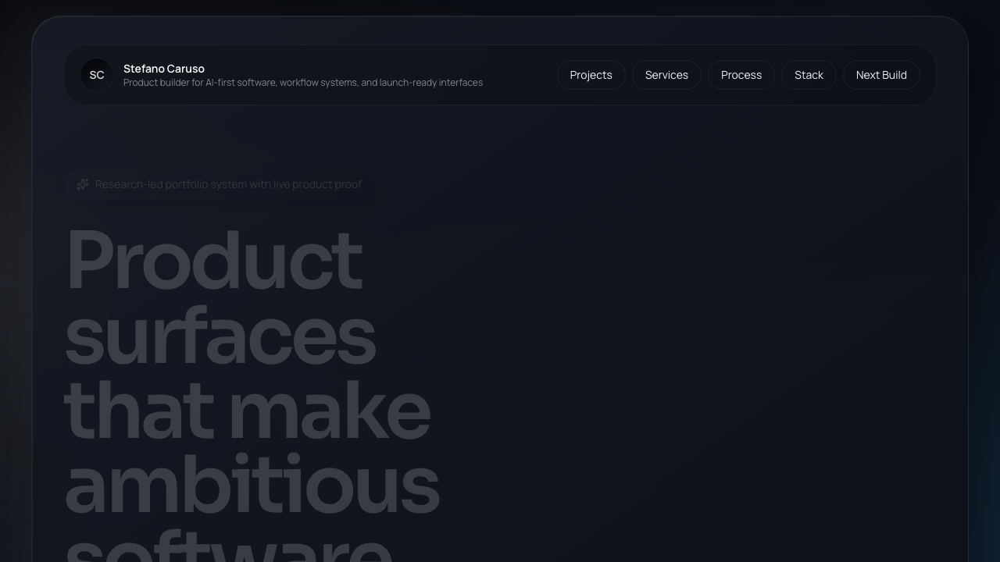

# Stefano Caruso Portfolio

Executive product portfolio built to showcase live launches, career depth, and a downloadable resume in a single polished Next.js site.




## Stack

- Next.js 16 App Router
- React 19
- TypeScript 5
- Tailwind CSS 4
- Motion
- Lucide React
- Playwright thumbnail capture script

## Site Structure

- Hero section with profile photo and executive overview
- Auto-looping project reel with live product and GitHub repo links
- Resume section with experience, skills, education, and certifications
- Local project thumbnails and hosted PDF resume in `public/`

## Projects

| Project | Live | Repo |
| --- | --- | --- |
| Ship | [Open](https://d1woqw06xb054i.cloudfront.net/login) | [Repo](https://github.com/StefanoCaruso456/ShipShape_Gov) |
| BrainStorm AI | [Open](https://brainstormaigauntletai.com/login) | [Repo](https://github.com/StefanoCaruso456/BrainstormAI) |
| LegacyLens | [Open](https://www.nationalseismichazardmaps.com/) | [Repo](https://github.com/StefanoCaruso456/National-Seismic-Hazard-Maps) |
| Ghostfolio | [Open](https://app.ghostclone.xyz/en/start) | [Repo](https://github.com/StefanoCaruso456/Ghostfolio) |
| Shipyard | [Open](https://shipyard1.vercel.app/) | [Repo](https://github.com/StefanoCaruso456/ShipYard) |
| Projectz AI | [Open](https://projectzai.com/) | [Repo](https://github.com/StefanoCaruso456/ProjectzAI) |

## Local Development

```bash
npm install
npm run dev
```

Open [http://localhost:3000](http://localhost:3000).

## Scripts

```bash
npm run dev
npm run build
npm run start
npm run lint
npm run capture:thumbnails
```

## Content Sources

- `data/portfolio.ts` for hero copy and project metadata
- `data/resume.ts` for experience, skills, education, and certifications
- `public/projects/` for project thumbnails
- `public/resume-stefano-caruso.pdf` for the downloadable resume

## Verification

- `npm run lint`
- `npm run build`
